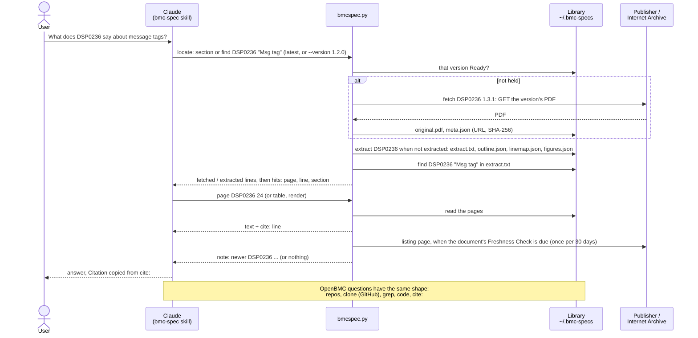

# bmc-toolkit

Claude Code plugin for BMC firmware developers.

The first skill, `bmc-spec`, answers questions about BMC specifications
(IPMI, DMTF MCTP / PLDM / SPDM / NC-SI / SMBIOS, Redfish, NVMe, OCP DC-SCM
and DC-MHS, I2C, SMBus, PMBus, eSPI, LPC, SFF, CMIS, TCG, UEFI, ACPI,
Arm server standards, NIST firmware resiliency and more) and about OpenBMC
source code. It keeps a local library of the documents and repositories you
have asked about, defaults to the latest published version of each document,
serves any specific version on request, and cites document, version, section
and page in every answer.

**Status: 1.0.0.** The Source Catalog lists 113 documents in
35 families. The 93 open ones are downloaded by the tool and every one of
them has been checked against the acceptance questions in
`docs/golden-questions.md`; the 20 gated, member and NDA documents are
listed with their tier and registered from your own copy. Which documents,
what each one's limits are and whether it has been verified:
[docs/SUPPORT.md](docs/SUPPORT.md) (the questions themselves are in
`docs/golden-questions.md`, and `catalog --table` names them per document).
How the catalog is kept and which versions it carries per publisher:
[docs/CATALOG.md](docs/CATALOG.md).

## Install

```
/plugin marketplace add ianmhuang/bmc-toolkit
/plugin install bmc-toolkit@bmc-toolkit
```

The same two steps from a terminal: `claude plugin marketplace add
ianmhuang/bmc-toolkit`, then `claude plugin install bmc-toolkit@bmc-toolkit`.

Requirements: Python 3.11 or newer on `PATH` as `python` or `python3`, and
`git`. Third-party packages listed in `requirements.txt` are installed once
into the plugin's data directory by a `SessionStart` hook; in a development
checkout run `pip install -r requirements.txt` yourself.

- `curl_cffi` (MIT): HTTP client with a browser TLS fingerprint. Without it
  the tool falls back to `urllib`: Intel documents then come from the
  Internet Archive instead of the publisher, OCP documents still download
  directly (both verified).
- `pypdfium2` 5.x (BSD-3-Clause or Apache-2.0): PDF text with character
  positions and bookmarks; older than 5.0 is refused (bookmark API change).
- `pdfplumber` (MIT): cell geometry and cell text of tables (ruled, and
  drawn as cell boxes), for `table`; loaded only by that command.

### Updating

Claude Code offers an update when the version in `plugin.json` rises, and
does not update third-party marketplaces on its own: enable auto-update for
`bmc-toolkit` in `/plugin` (Marketplaces tab), or run
`claude plugin update bmc-toolkit@bmc-toolkit`. The Library and the packages
the hook installed stay in place. When an update changes the extractor,
`status` marks documents `stale`; `extract --all` re-extracts them without
downloading anything.

## How a question is answered



Solid arrows are commands and Library access, dashed arrows what comes back.
A reading command brings the version it needs to Ready (held and extracted)
by itself: the catalog's latest, or the one `--version` names; a version
the tool cannot download is registered from your copy with `add`. The
publisher is contacted only when the Library lacks the version, and once
per document per 30 days to ask whether it lists a newer one (reported,
never downloaded). Every printed page carries a `cite:` line and the skill
copies its Citation from that line. What each command does:
[docs/COMMANDS.md](docs/COMMANDS.md).

## Library location

Documents and code checkouts live under `~/.bmc-specs/` by default. Set
`BMC_SPEC_LIBRARY` to move it. The path is shared by every project on the
machine. Documents sit at `specs/<family>/<document>/<version>/`, Code
Trees at `code/<repo>/<commit>/`; what each directory holds is in
[docs/LIBRARY.md](docs/LIBRARY.md).

## Command line

The skill drives `skills/bmc-spec/scripts/bmcspec.py`; you can run it
yourself. The examples use a shell alias for it:

```
alias bmcspec='python skills/bmc-spec/scripts/bmcspec.py'

bmcspec catalog              # every document, one per line
bmcspec catalog DSP0236      # one document, all versions
bmcspec catalog --table --golden docs/golden-questions.md   # Support Level table, one flat table
bmcspec catalog --table --by-family --golden docs/golden-questions.md   # the same per family (docs/SUPPORT.md)
bmcspec fetch DSP0236        # latest published version
bmcspec fetch DSP0236 --version 1.2.0
bmcspec fetch PMBUS-II --version 1.3.1   # the latest is gated: fetch names this one
bmcspec fetch IPMI --version "2.0 rev 1.1"
bmcspec fetch --all          # several hundred MB
bmcspec add vendor.pdf --document DSP0236 --version 1.1.0   # --force to replace
bmcspec scan                 # register hand-placed files
bmcspec status
bmcspec check DSP0236        # is the catalog behind DMTF? (no download)
bmcspec check                # every document with a listing, plus the OpenBMC release
bmcspec refresh --write      # maintainer: add the versions the publishers list
bmcspec extract DSP0236      # text, outline, line map, figures
bmcspec extract --all
bmcspec section DSP0236 8.1  # level | title | pages, per matching entry
bmcspec find DSP0236 "Msg tag" --context 1   # hits with page, line, section
bmcspec page DSP0236 24 --to 25              # the pages, with a cite: line each
bmcspec page DSP0236 --section 8.2
bmcspec render DSP0236 --page 24             # renders/page-24.png
bmcspec table DSP0236 --page 122             # the table(s) on the page, whole
bmcspec table DSP0239 --page 13              # a table drawn as cell boxes, no rules
bmcspec schema DSP8010 Chassis --property PowerState   # the JSON Schema bundle, fetched and unpacked as needed
bmcspec registry DSP8011 Base PropertyValueTypeError
bmcspec schema DSP8013 RedfishInteroperabilityProfile --definition ReadRequirement
bmcspec repos --topic redfish                # repositories and held Code Trees
bmcspec clone bmcweb                         # default branch, shallow
bmcspec clone pldm --release 2.18.0          # the commit OpenBMC 2.18.0 ships
bmcspec grep bmcweb CurrentPowerState --context 2
bmcspec code bmcweb redfish-core/lib/chassis.hpp --lines 160-175
bmcspec prune                # list superseded Code Trees; --yes removes them
```

Exit codes, the `--wait` flag (several Claude Code conversations can share
one Library), flags, output formats and `config.toml`:
[docs/COMMANDS.md](docs/COMMANDS.md).

## What the tool does on the network and on disk

- Downloads only URLs listed in the Source Catalog, the publisher's first
  and then the Internet Archive's snapshot of it; a manual document is
  never requested, and a response that is not the expected PDF or ZIP is
  discarded. A reading command downloads the version it answers from when
  the Library lacks it (`offline = true` in `config.toml` stops that).
- Writes only under the Library and replaces nothing there without
  `--force`. From a Redfish ZIP bundle only the schema or registry files an
  answer needs are unpacked.
- `check`, `refresh` and a reading command whose document is due for a
  check (once per 30 days) read publisher listing pages and download no
  document. `refresh --write` is the one command that writes outside the
  Library: it inserts version entries into the catalog file it was given.
- Runs `git` as a subprocess for `clone`, `grep` and `code`, and
  `gh search code` for `repos --search`; `clone` writes only under the
  Library's `code/` directory. Nothing else is executed, and nothing is
  re-uploaded or redistributed. The full list, with file counts and the
  listing URLs, is in [docs/COMMANDS.md](docs/COMMANDS.md).

## Further reading

- [docs/COMMANDS.md](docs/COMMANDS.md): every command in detail,
  `config.toml`, the Freshness Check, network and disk behaviour.
- [docs/LIBRARY.md](docs/LIBRARY.md): the files under the Library and what
  each one holds.
- [docs/CATALOG.md](docs/CATALOG.md): how the Source Catalog is kept, which
  versions it carries per publisher, and how to add one.
- [docs/SUPPORT.md](docs/SUPPORT.md): the Support Level table per family.

## Development

```
pip install -r requirements.txt -r requirements-dev.txt
ruff check .
ruff format --check .
python -m pytest -q
```

The same commands run on GitHub Actions for every pull request (Linux and
Windows) and every push to main (Linux, Windows and macOS).

## License

MIT. The specifications the tool downloads remain under their publishers'
licences and are never redistributed with this repository.
